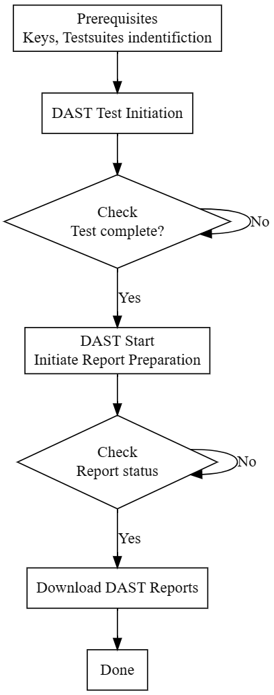

# Dast test flow



## 1. Prerequisits:

Need configuration values like apikey, org, app, url of dast api, and testConf with include test suites to include and exlude.

## 2. Dast Test Initiation:

* Sends a POST request to the Dast API initiate Dast Test with all the reqired test test suites and other configurations.
* The Dast API initiates the Dast test based on the provided configuration.

## 3. Dast Test Monitoring:

* Use the check dast status api to retrieve the status of the Dast test.
* Poll the API at regular intervals until the test finishes.

## 4. Report Download and Artifact Creation:

* Upon completion, checks the availability of different Dast reports.
* Wait and check until all the reports are ready
* Downloads the desired reports (API Coverage, Dast Scan, Dast Scan Summary) if available using Download Dast reports api


## REST API to Initiate a Dast Test

This API allows you to initiate a Dast test via the AppSentinels REST API.

**Method:** POST

**URL:** `/api/v1/{org}/{application_id}/tests`


**Replace `{application_id}`** with your actual application ID.
**Replace `{org}`** with your actual organization ID.

**Request Body (JSON):**

```
{
  "test_initiater": "API", // mandatory
  "name": "My Dast Test", // mandatory
  "target_url": "https://example.com", // mandatory
  "test_suites": ["api-testing"], // optional
  "allowed_endpoints": [], // optional
  "blocked_endpoints": [], // optional
  "request_timeout": 60, // optional
  "overwrite_host_header": false, // optional
  "auth_config": {} // optional
}
```

**Headers:**

* Authorization: Your AppSentinels API key prefixed with "AppSentinels "
* Content-Type: application/json

**Response (JSON):**

```
{
  "test_id": "123456",
  "start_time": "2023-10-26T15:00:00Z",
  "status": "IN_PROGRESS",
  "status_detail": "Test is currently running."
}
```

**Additional Notes:**

* Refer to the AppSentinels API documentation for details on additional parameters and error codes.
* A valid API key is required for access.

## REST API to Check Dast Test Status:

**GET /api/v1/{org}/{application_id}/tests/{test_id}/status**


**Parameters:**

* **application_id:** String (required). The ID of the application containing the Dast test.
* **test_id:** String (required). The ID of the Dast test to check the status of.
* **org:** String (required). The ID of the organization containing the application.

**Headers:**

* **Authorization:** String (required). Your AppSentinels API key prefixed with "AppSentinels ".
* **Content-Type:** String (optional). Defaults to "application/json".

**Response:**

```json
{
  "test_id": "123456",
  "start_time": "2023-10-26T15:00:00Z",
  "end_time": null,
  "status": "IN_PROGRESS",
  "status_detail": "Test is currently running.",
  "test_cases_executed": 10,
  "application_issue_found": 2,
  "duplicate_alerts": 0,
  "policy_last_update": "2023-10-26T14:00:00Z",
  "training_last_update": "2023-10-25T13:00:00Z",
  "test_suites": ["api-testing"]
}
```

**Notes:**

* Replace `{application_id}` and `{test_id}` with the actual values.
* The response contains details like start time, end time (if finished), status, executed test cases, identified issues, and other information.


## Dast Report Availability

**Method:** GET

**URL:** `/api/v1/{org}/{application_id}/tests/{test_id}/reports`

**Parameters:**

* **application_id:** String (required) - The ID of the application containing the Dast test.
* **test_id:** String (required) - The ID of the Dast test to check the report availability for.
* **org:** String (required) - The ID of the organization containing the application.

**Headers:**

* **Authorization:** String (required) - Your AppSentinels API key prefixed with "AppSentinels ".
* **Content-Type:** String (optional) - Defaults to "application/json".

**Response (JSON):**

```json
{
  "available_reports": ["api-coverage", "dast-scan", "dast-scan-summary"]
}
```

## Download report APIs

**API Coverage Report:**

* Method: GET
* URL: `/api/v1/{org}/{application_id}/tests/{test_id}/reports/api-coverage`

**Dast Scan Report:**

* Method: GET
* URL: `/api/v1/{org}/{application_id}/tests/{test_id}/reports/dast-scan`

**Dast Scan Summary Report:**

* Method: GET
* URL: `/api/v1/{org}/{application_id}/tests/{test_id}/reports/dast-scan-summary`

These APIs allow you to download specific reports based on your needs. Remember to replace the placeholder values with your actual application and test IDs.

